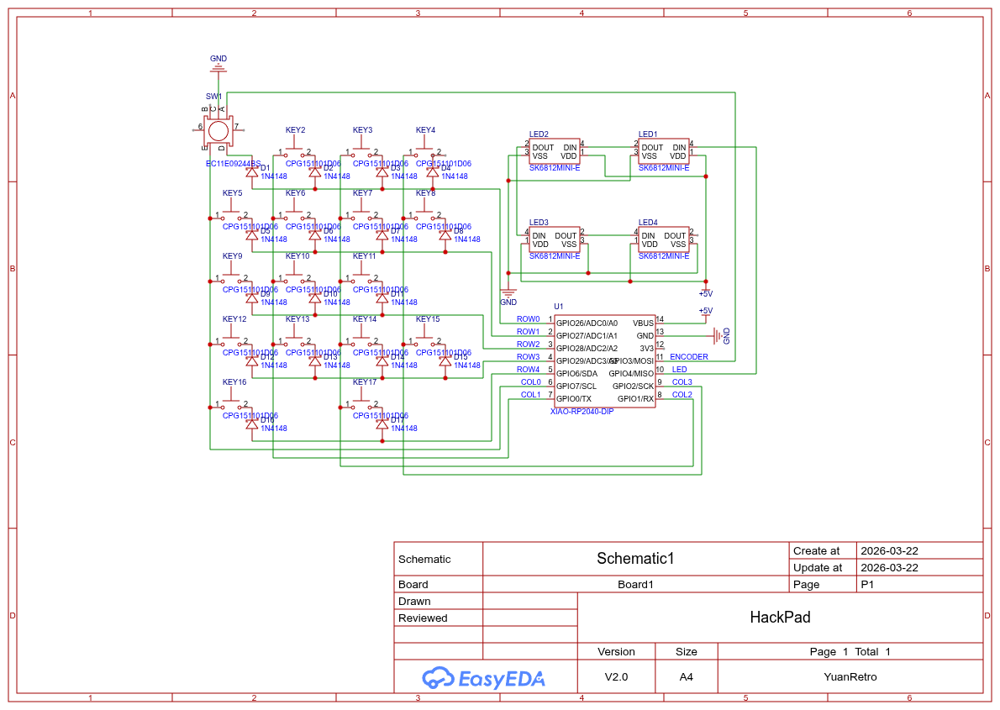
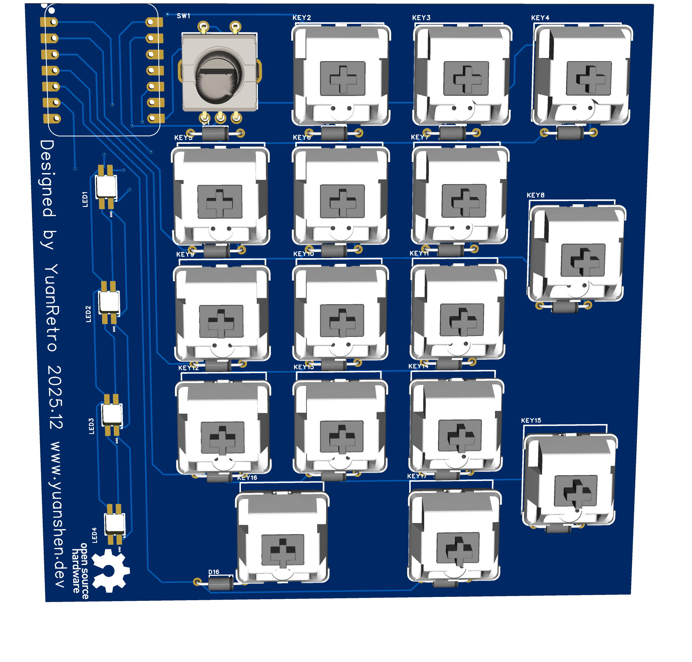
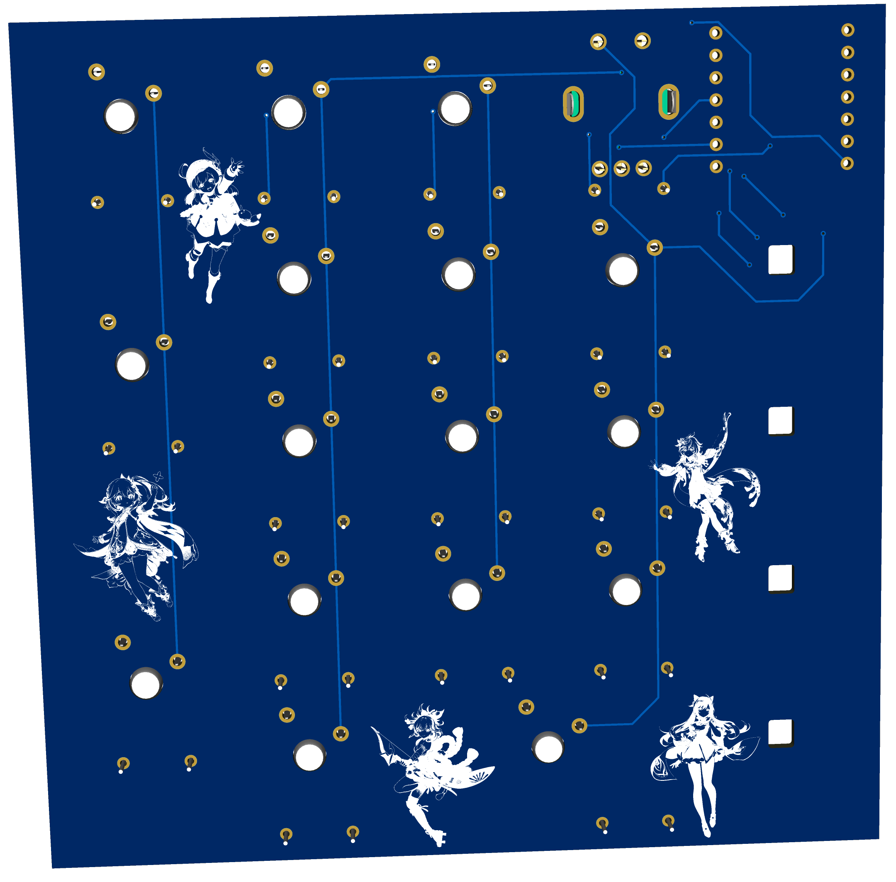
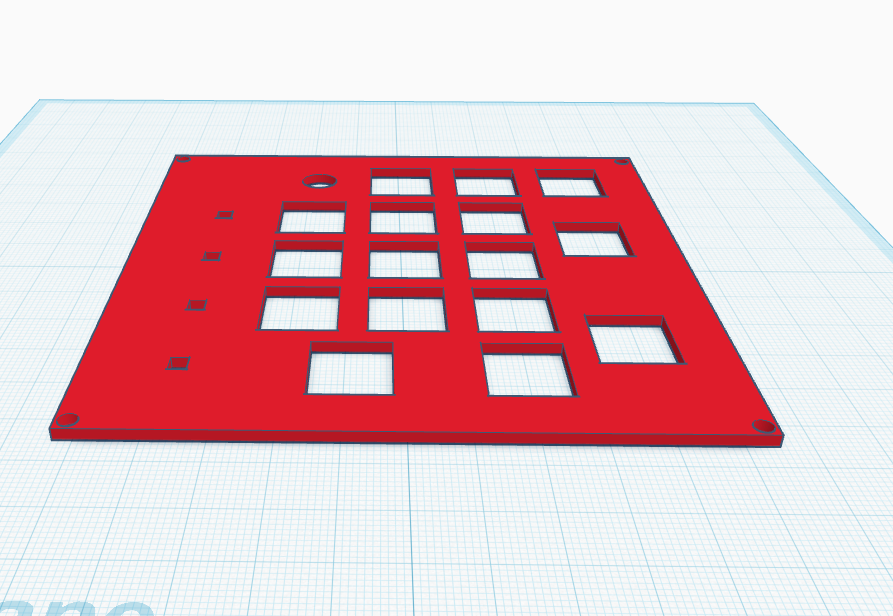
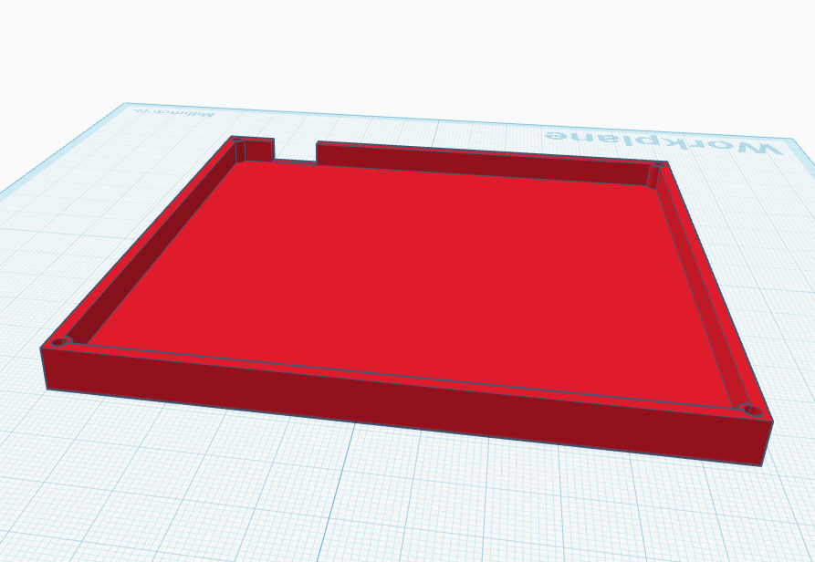
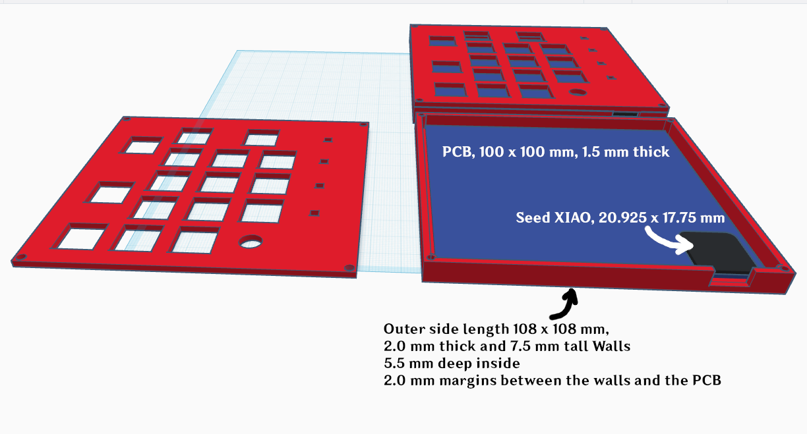
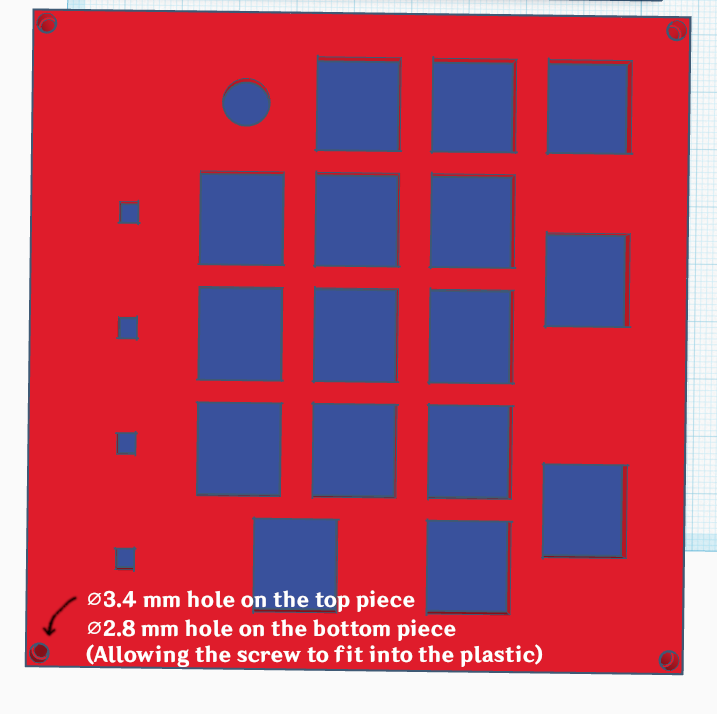
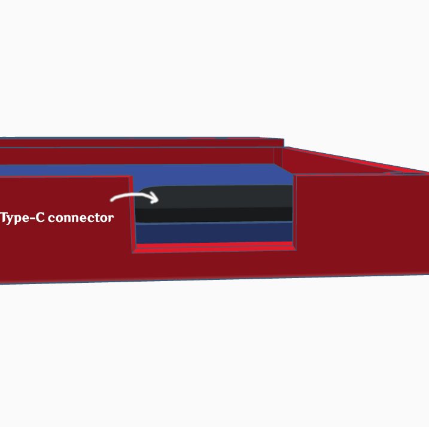
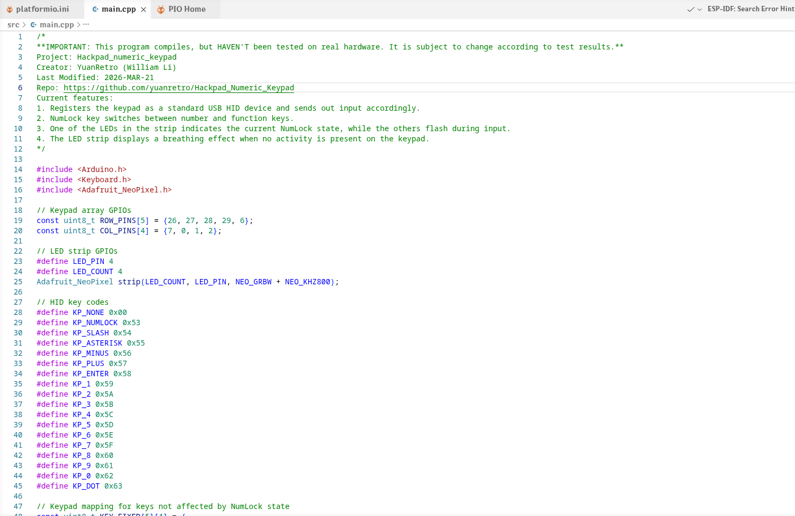

# HackPad: Numerical Keypad

By YuanRetro (William) Li, 2025.12 - 2026.3

Email: [admin@yuanshen.dev](mailto:admin@yuanshen.dev)

GitHub Repo: <https://github.com/yuanretro/Hackpad_Numeric_Keypad>

Last Revision: 2026-MAR-22

## Revisions 2026-MAR-22

All issues stated are being dealt with. The keypad is downsized to 16 keys, and the push button of a rotary encoder replaces the NumLock key. As there isn't enough GPIO left for the encoder, I decided to only wire one output pin to the controller. This configuration only allows the detection of the distance of rotation and not the direction, but this can be partially resolved by detecting whether the switch is being pressed during rotation and alter the direction of the controls accordingly. (Don't worry about the one extra diode, I have spare components myself.)

The LEDs are being updated to the Mini-E variant of SK6812, and all diodes are now through-hole mount. Strangely enough, there seems to be some design issues with the package of the LEDs in EasyEDA. The slot region and the SMD pads are in minor conflict. This shouldn't affect anything despite of giving out nasty errors in the DRC check.

For the casing, I added 4 mounting holes on the corners, each measured around 2.8mm, allowing the screws to fit tightly inside the plastic and hold the two pieces together. An assembled view is also available down below.

The firmware haven't been updated, and I will do this step once the hardware part is complete.

## Introduction

This is my custom variant of [*HackPad*](https://github.com/hackclub/hackpad), an open-source keypad designed by *HackClub*. My project is loosely based on this, but I chose a different path for many elements of my design. Instead of only a few keys like the sample design, I incorporated a full-size computer numpad, very useful for small-size laptops that lack one. For many games I've played, especially simulation games like *Microsoft Flight Simulator* or *SimRail*, the numpad plays a crucial role in the controls, and it would be a pain to play them without one. 

For example, I used *EasyEDA* for the PCB design instead of *KiCAD*, as I have quite a lot of previous experience with it since I designed my first PCB back in 2023. It is also much easier to order PCBs right from the editor, and this makes the whole process less error-prone. I designed my 3D-printable shell initially with *Tinkercad*, but made use of *Autodesk Fusion* for the final touches. I have an Ender 3 V2 printer myself, and I will be able to print the whole casing myself. I am sure that the casing may not work on the first try, as I don't currently have the assembled PCB on hand. I will be able to do some minor tweaks once the PCB is up and running. Finally, instead of making use of the *QMK* firmware, I decided to write my own in C++ using the Arduino framework. I was able to compile it in the *PlatformIO* environment and export the .uf2 file, but I don't know if it works on the real hardware yet. This is also subject to minor changes.

I started working on this project in mid-December last year, but I was busy with school most of the time and almost forgot about it. This week, during March Break, I was able to pick it up and give it a finishing touch, and I hope the final product will work fine!

Honestly speaking, I think I am also much more confident with projects like this after I successfully completed the final performance task for my Computer Engineering course at school this January. For that project, called *Funnicator*, I designed a pair of text communication devices along with my partner, which use an ESP32-S3 microcontroller and sit in a custom 3D-printed case. Our teacher liked them. It was my first time designing 3D-printed items, and it helped me a lot when designing the case for my keypad, which is even more complicated.

## Schematics and PCB Design

As previously stated, I designed my PCB in EasyEDA. It is 10 cm by 10 cm exactly (this is somewhat important for minimizing the cost of the PCB, somehow), and I managed to fit a full-size arrangement of mechanical switches for a numpad. The keyboard matrix comes in a 5-row by 4-column arrangement, and takes up 9 GPIOs on the RP2040 microcontroller. Each individual switch is paired with a 1N4148 diode, to prevent current from flowing back and enable multiple keypresses at once. I used one extra GPIO for the 4 SK6812 LEDs forming a strip, and another one for one pin of the rotary encoder. As there is no vacant GPIO left, I was unable to detect the direction the encoder is rotating, but I can overcome this by reversing the direction of the controls when the button is pressed whilst rotating the encoder.

(clockwise from top-right: Collei, Keqing, Yoimiya, Nahida, and Klee)

## Parts Required

1 x Seeed Studio XIAO RP2040 Microcontroller

1 x EC11 Rotary Encoder

4 x SK6812 Mini-E Color LED

4 x M3 Screws of appropriate length (Supplied by myself)

16 x Standard Mechanical Key Switches

16 x Key Caps

17 x 1N4148 Diode (I can supply the extra)

## Case Design

The case design is rather primitive, as I will definitely make some further tweaks once the PCB assembly is ready.  My idea for the casing is that it covers only the PCB and allows a small portion of the switch bodies to protrude above the case. This design can be found in many commercially available mechanical keyboards.

## Assembled View

## Firmware

The firmware is written using the PlatformIO Arduino framework in C++. This can be changed at any time to fix bugs or add new features.

Current features of the firmware:

1. Registers the keypad as a standard USB HID device and sends inputs accordingly.

2. The NumLock key switches between number and function keys.

3. One of the LEDs in the strip indicates the current NumLock state, while the others flash on input.

4. The LED strip displays a breathing effect when the keypad is idle.

## Final Words

This project is rather novel to me, as it is my first time working with a RP2040 and USB HID devices. But it turned out easier than I originally thought it would be, and I hope it will work fine once everything is put together in the end!
